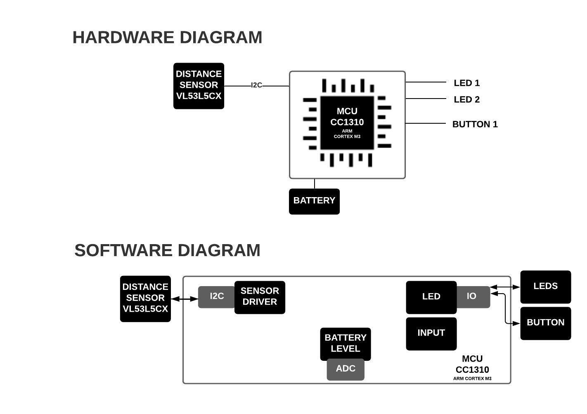
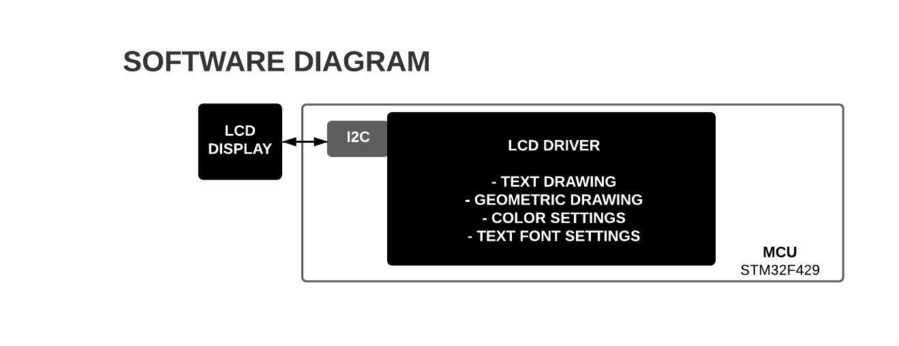

# Exercise 2.1 - Idea project diagram

Make a block diagram describing an embedded system you’d like to have or make. Be
imaginative. Reality does not apply here.

This is a prototype of a device to be installed on shutters and gates. The device communicates with a gateway through the radio present in the microcontroller and sends the percentage of opening of shutters and gates to the gateway. A distance sensor (up to 4 meters) is being used in this project.

# Exercise 2.2 - Read mbed code, make diagram

I am considering choosing an STM32 microcontroller, because I haven't worked with the STM32 family yet. I will go out of my comfort zone to learn how to work with these devices. I purchased a 32F429IDISCOVERY board that already contains an LCD display so I can start practicing.

I'm using a template in mbed with code that writes some text on the screen.

- Platform: DISCO-F429ZI
- Template: Basic example showing how to drive the LCD (DISCO-F429ZI_LCD_demo)

