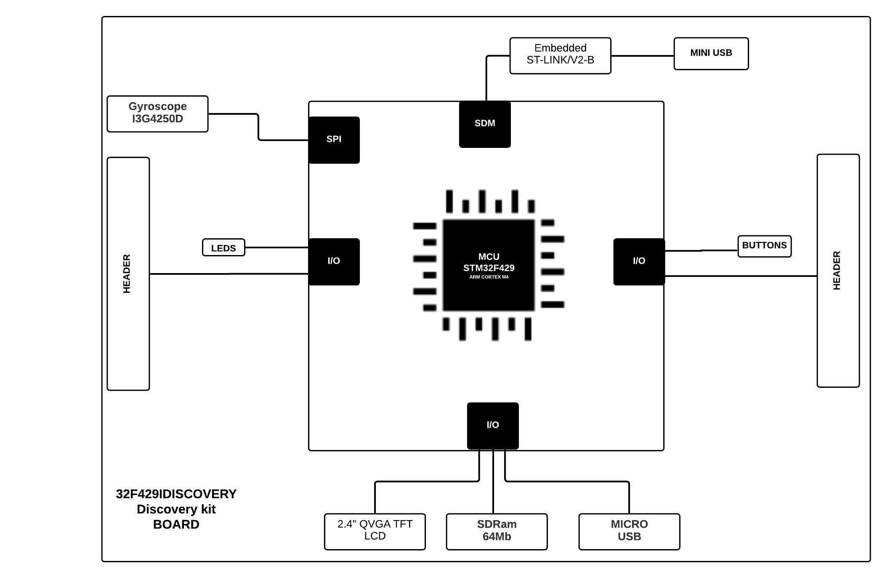

# Investigate project board

Look at the documents for the board you are considering for your final project (or any ST Discovery Board), draw the hardware block diagram for the board. For peripherals, note the communication paths (SPI, I2C, etc).
Look at the datasheet for the processor and other documents. Answer these questions:

- What kind of processor is it?
- How much Flash and RAM does it have? Any other memory types?
- Does it have any special peripherals? (List 3-5 that you noted as being interesting.)
- Does it have a floating point unit?
- If it has an ADC, what are the features?
  Look at one application note for this processor.

## Hardware Block Diagram - 32F429IDISCOVERY

Processor: STMicroelectronics Arm® Cortex®-M4 core-based STM32F429 high-performance
microcontroller

RAM Memory: 256Kbytes (internal) / 64Mbit SDRAM (external)

Flash Memory: 2 Mbytes

Special peripherals:

- 2.4" QVGA TFT LCD
- I3G4250D Motion Sensor 3-axis digital output gyroscope
- Six LEDS
- Two Push Buttons

FPU: Floating point unit (FPU) single precision

ADC: 03 (three) 12-bit ADCs

Application:
Detection of abnormal machine vibration using machine learning models. With the support of the LCD screen it is possible to see the results graphically without needing another equipment for visualization.
